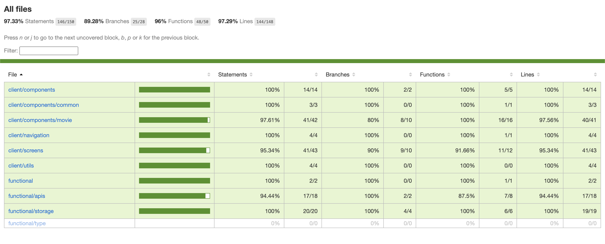
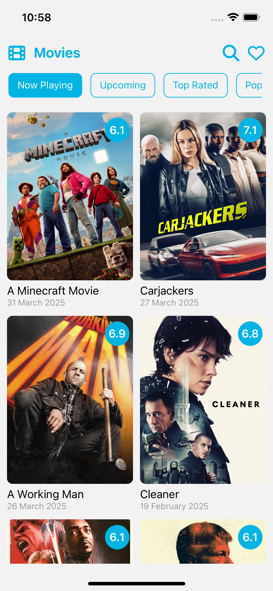
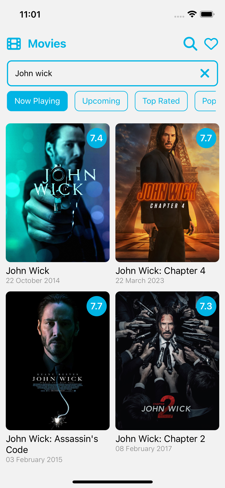
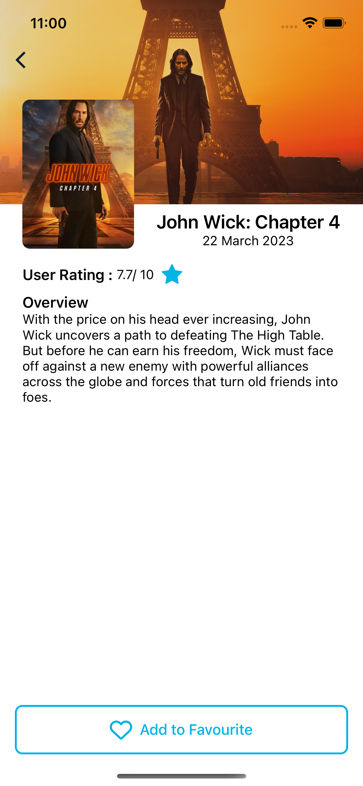
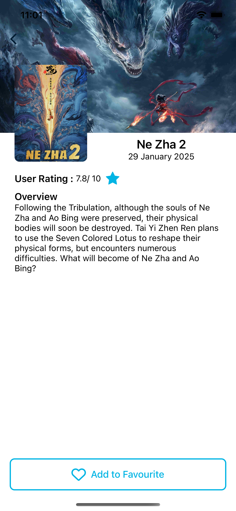
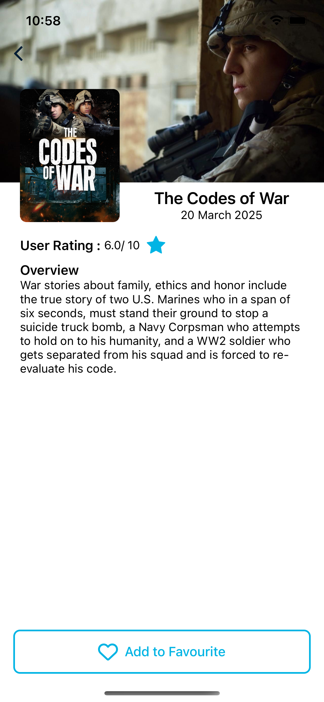
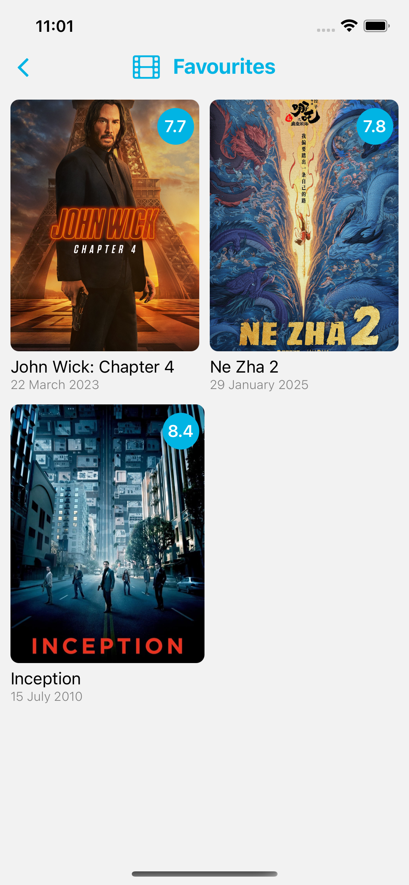
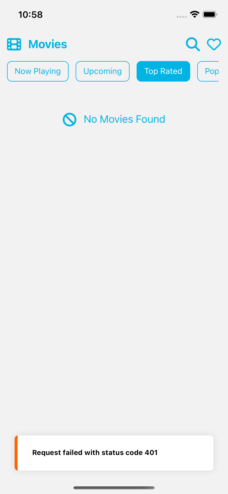

# MovieApp

A rating app for Movies

## Highlights
- **@tanstack/react-query** For query calls
- **useInfiniteQuery** For infinite scrolling with cache
- **jest and @testing-library/react-native** for testing
- **unit tests coverage above 97% for every component**
- **No screen refresh on tab change due**
- Error handling with **@tanstack/react-query**
- Created UI with Primary colors


## Features
- home screen with movie categories tabs
- movies with smooth infinite scroll
- search movies with infinite scroll
- cached api calling with **@tanstack/react-query**
- works for both android and ios
- add to favourites functinality
- Displayed error with **Toast**


# Getting Started

### secrets
- **Note**: I have pushed .env too for your convenience 
- need a token to start the project get the token from https://developer.themoviedb.org
- replace the token placeholder in .env

### For Android

```bash
# using npm
npm run android

# OR using Yarn
yarn android
```

### For iOS

```bash
# using npm
npm run ios

# OR using Yarn
yarn ios
```

## screenshots

<table>
  <tr>
    <td align="center">
      
    </td>
  </tr>

</table>


<table>
  <tr>
    <td align="center">
      
    </td>
    <td align="center">
      
    </td>
    <td align="center">
      
    </td>
  </tr>
  <tr>
    <td align="center">
      
    </td>
    <td align="center">
      
    </td>
    <td align="center">
      
    </td>
  </tr>
  <tr>
    <td align="center">
      
    </td>
  </tr>
  <tr>
    <!-- Add additional screenshots here -->
  </tr>
</table>

